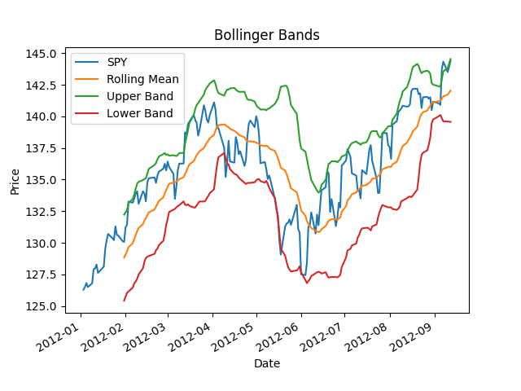

# 📈 Bollinger Bands Visualizer

This Python script fetches stock data from CSV files and visualizes **Bollinger Bands**, a technical indicator used to measure price volatility and trends in financial markets.
This project was used in gaining familiarity with Pandas and Matplotlib functionalities.

Objectives include:

- Familiarity with reading data from a csv
- Manipulating, slicing, and indexing data from a Pandas DataFrame
- Performing operations on arrays
- Plotting data in specific time periods
- Experience working with technical indicators (Rolling Mean, Bollinger Bands)

---

## 🔧 Features

- Loads adjusted closing prices from CSV files
- Calculates:
  - 20-day rolling mean
  - 20-day rolling standard deviation
  - Upper and lower Bollinger Bands (mean ± 2×std)
- Plots:
  - Actual stock prices
  - Rolling mean
  - Upper and lower Bollinger Bands

---

## 📁 Folder Structure

<pre>
BOLLINGER-BANDS/
├── data/
│   ├── SPY.csv
├── bollinger_bands.py
├── requirements.txt
└── README.md
</pre>

---

## ▶️ How to Run

1. Make sure your virtual environment is activated (optional but recommended)
2. Ensure CSV files are placed in the `data/` folder
3. Then run:

python bollinger_bands.py

---

## ⚙️ Configuration

You can modify these values directly in `bollinger_bands.py` to customize the script:

### 📅 Date Range

Set the time period for the data you want to analyze:

```python
start_date = '2012-01-01'
end_date = '2012-12-31'
```

### 📈 Tickers

Only stock tickers analyzed in this project is SPY

```python
tickers = ['SPY']
```

### 🪟 Rolling Window

Adjust the number of days for calculating the rolling mean and standard deviation:

```python
window = 20
```

### 📊 Output



The script displays a line chart showing:

- Actual stock price (SPY)
- 20-day rolling mean
- Bollinger upper and lower bands

All values are aligned by date.
